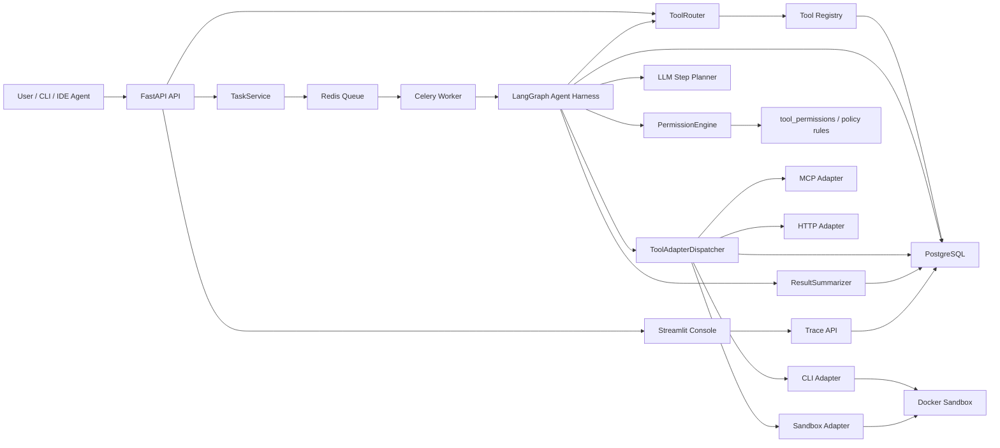
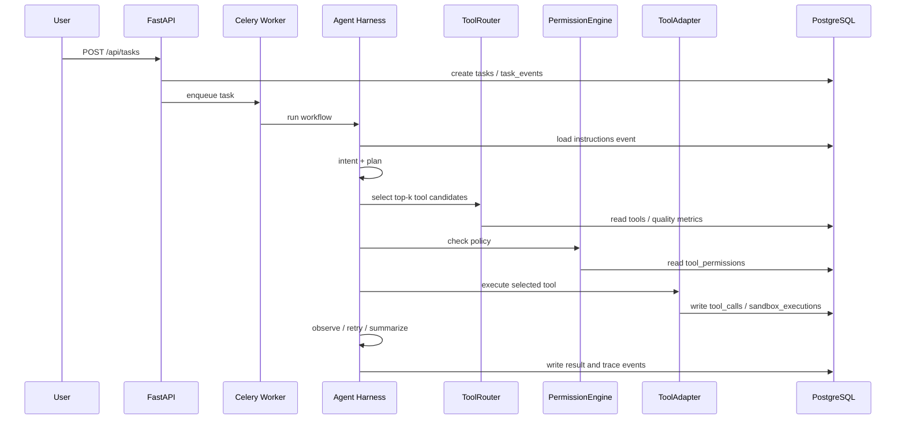

# ToolHub 架构说明

ToolHub 定位为面向 CLI / IDE Agent 的 Agent Tool Runtime / Harness MVP。它不是单纯的 MCP 注册中心，而是把工具接入、路由、权限、安全执行和审计追踪串成一条可解释的执行链路。

## 总体架构

## 执行链路

## LLM 的边界

LLM 负责：

- 理解用户意图
- 给出多步计划建议
- 在失败后根据 observation 修正 `tool_input`
- 对 top-k 候选工具给出 rerank 建议
- 总结最终结果

系统负责：

- 工具 schema 校验
- 工具路由最终选择
- 权限决策
- 审批边界
- CLI / Sandbox 隔离执行
- 审计记录和敏感信息脱敏

这个边界是项目的核心设计点：LLM 提供建议，系统做最终控制。

## 核心数据模型

- `tools`：工具元数据、schema、风险等级、质量指标
- `tool_versions`：工具版本快照
- `tasks`：后台 Agent 任务状态和运行配置
- `task_events`：任务执行事件流
- `tool_calls`：工具调用输入、输出、耗时、replay 来源
- `llm_calls`：LLM 调用审计
- `sandbox_executions`：Docker 沙箱执行记录
- `approval_requests`：高风险操作审批请求
- `tool_permissions`：多维权限策略

## Trace Console

`GET /api/traces/{trace_id}` 会聚合：

- task
- task_events
- tool_calls
- llm_calls
- sandbox_executions
- approval_requests
- timeline
- error_types

Dashboard Console 直接消费这条聚合链路，用来回答：

- 为什么选了这个工具？
- 哪一步失败了？
- 是否被权限拦截？
- 是否触发了审批？
- 是否发生过 replay？
- 工具执行输入输出是什么？
